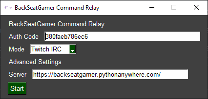
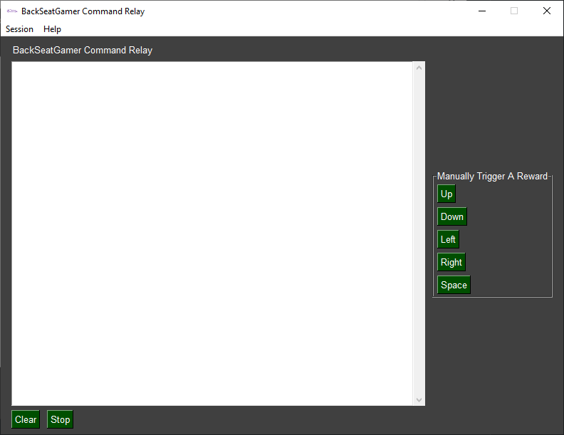

# Command Relay
The desktop app to replay commands from other sources (such as Twitch Chat) to the BSG Server

Note that the reverse proxy is also needed to send the commands to the game. They can both be run on the same machine with no issues.

Using this tool, no signup is necessary. Your guests only need to enter commands and everything else is handled automatically. When using this tool, the web interface for guests is still active, however, if a guest is using both the web interface AND commands through this tool, that guest will have two active accounts. To prevent guests from using the web interface, simply refrain from distributing the share link.

The bot also provides commands which can be used by users so the web interface is not needed. See each mode for the exact syntax of the command (while the commands are the same, the formatting of the command depends on the platform being used, for example, Twitch commands are prefixed by `!` character). If the guest can not afford the reward or they have used it too frequently, the bot will reply to their message with an error message describing why the command could bot be executed.

The `help` command returns a list of available rewards. It has the following alias:
- `help`
- `h`
- `commands`
- `rewards`

The `balance` command returns the current balance of the player. It has the following alias:
- `balance`
- `bal`
- `ball`
- `points`

## Running
To run, simply run `CommandRelay.exe` (or `BackSeatGamerCommandRelay.py` if you are running from source). You will then be greeted with the following interface:

The auth code is the code listed on your session page of BackSeatGamer. The `mode` is based on the source of the commands to relay. See the `Modes` section for a complete list. Currently only one source is supported so if you wish to have multiple, you will need to run multiple instances of this application.

By clicking `Start`, you may be asked for additional information. If you are, enter the settings as defined by the mod creator. Finally, you will be greeted with the following interface:

When you reach this screen, everything is connected and configured properly between the relay and the BackSeatGamer Server.

This interface is an example from a TwitchPlays mod. The buttons along the right-hand side will not be the same in all cases. 

The large box on the left side of the screen is the event log. Each time a reward is redeemed, an entry will be added. You can click the `Clear` button at the bottom of the screen to clear the log.

Beside the `Clear` button is the `Stop` button. Clicking this will stop the relay from running and return you to the main interface where you can begin a new session.

The right-hand side of the screen contains a button for each possible reward. Clicking on the button will manually trigger it as a user under the name `ManualTrigger` (This will also cause a new guest to appear in the web interface under the name `ManualTrigger`). Triggering this way will **NOT** bypass any cool-downs or point costs configured server side. Even rewards which are disabled will be listed here.

Thank you for using the Command Relay (The recommended way to interact with BackSeatGamer). If you encounter any issues or have suggestions, please refer to our [Issue Tracker](https://github.com/BackSeatGamerCode/CommandRelay/issues).

## Modes
The following is a list of available modes and a description of each. More will be added in the future. If you would like to request a new mode, you may do so in the [Issue Tracker](https://github.com/BackSeatGamerCode/CommandRelay/issues).

### Twitch IRC
This mode allows the bot to listen to Twitch Chat and adds a few other helpful commands for a guest.

To trigger a command, your guest simply enters the command `![name]` where `[name]` is the name of the reward. Reward names are case insensitive. In other words, if you have a reward called `Spawn Zombie`, then a guest can use the command `!Spawn Zombie`, `!spawn zombie`, or even `!SPaWn zOmBIe` to trigger it.

The following is a list of built in commands available:

The `!help` command returns a list of available rewards. It has the following alias:
- `!help`
- `!h`
- `!commands`
- `!rewards`

The `!balance` command returns the current balance of the player. It has the following alias:
- `!balance`
- `!bal`
- `!ball`
- `!points`
